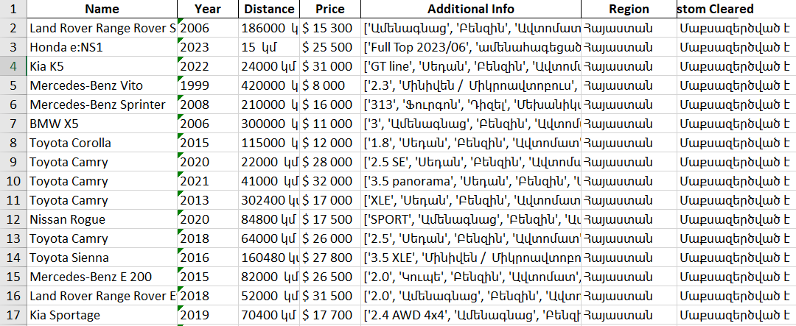
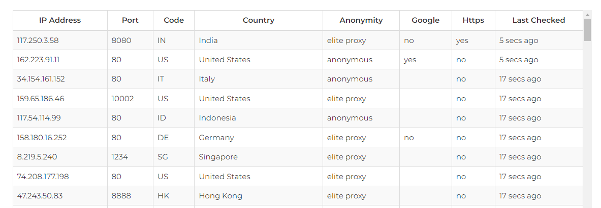
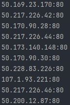

# Web Scraping Auto.am

[](https://www.python.org/downloads/release)
[](https://pypi.org/project/beautifulsoup4)
[](https://pypi.org/project/requests)
[](https://pypi.org/project/pandas)
[](https://pypi.org/project/openpyxl)

This Python script utilizes the functionalities of modules such as BeautifulSoup, requests, and pandas to scrape 
information from 'https://auto.am/', a platform where people post offers to sell their cars. The script extracts details such as
model, price, year, region, and other relevant information. The intention behind gathering this data is to use it for machine learning (ML) and artificial intelligence (AI) purposes.

## Result

#### Program returns about 10 000 car information

## Prerequisites

- Python 3.x
- Required Python packages: BeautifulSoup, requests, pandas,openpyxl

## Installation

```bash
pip install beautifulsoup4 requests pandas openpyxl
```

# Free Proxy List Scraper

This Python script scrapes a list of free proxies from 'https://free-proxy-list.net/' using the requests and BeautifulSoup modules.

## Usage
From Web-Page scrapes the info that is easy to use and returns 50 proxies.


## Result



## Installation

```bash
pip install beautifulsoup4 requests
```